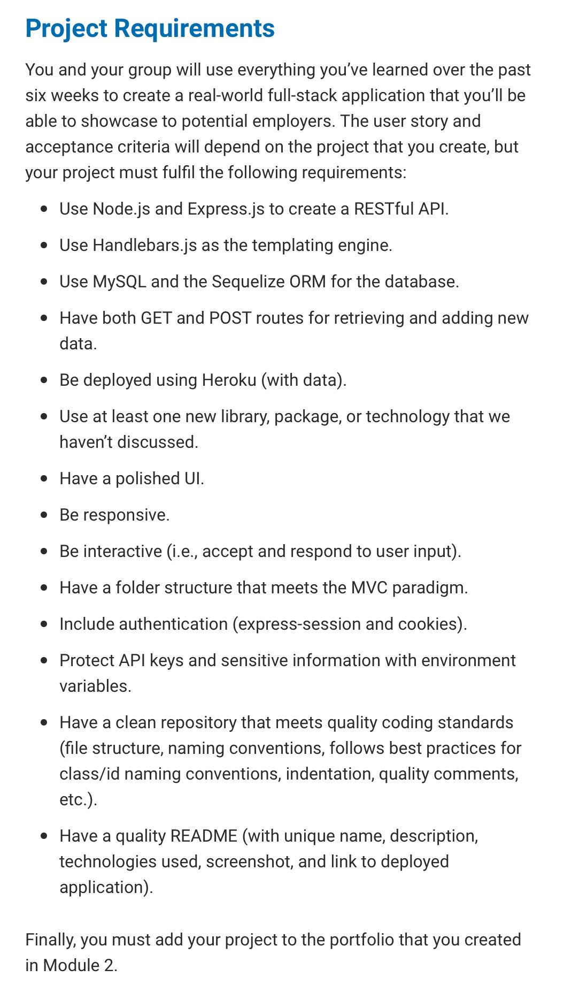

# project2
Code-Mantic, a tech-savvy dating website deployed on Heroku.

 

## Description

## Table of Contents

- [Installation](#installation)
- [Dependencies](#dependencies)
- [HTTP Status Code](#http-status-codes)
- [Bootstrap](#bootstrap)
- [MySQL2](#mysql2)
- [Github](#github)
- [School Instructions](#school-instructions)
- [MISC](#misc)
- [License](#license)
- [How to Contribute](#how-to-contribute)
- [Badges](#badges)
- [Tests](#tests)
- [Features](#features)

## Installation

## Dependencies

- [Express](https://www.npmjs.com/package/express)popular web application framework for Node.js that simplifies process of building web applications/APIs
npm install express

- [Express-handlebars](https://www.npmjs.com/package/express-handlebars) view engine for Express.js that allows you to use Handlebars templates in applicatio
npm install express-handlebars

- [bcrypt](https://www.npmjs.com/package/bcrypt) library for hashing passwords securely
npm install bcrypt

Want to install all at once?
npm install express express-handlebars bcrypt

## HTTP Status Codes

What are they?

Three-digit numbers returned by a web server in response to a client's request made to the server.

Most Common Status Code:

400 Bad Request: The server cannot or will not process the request due to something that is perceived to be a client error (e.g., malformed request syntax, invalid request message framing, or deceptive request routing).

200 Sucessful: The request succeeded.

Links:

- [HTTP status codes](https://developer.mozilla.org/en-US/docs/Web/HTTP/Status)

## Bootstrap

Links:

- [Bootstrap Website](https://getbootstrap.com/)
- [Bootstrap Examples](https://getbootstrap.com/docs/5.3/examples/)
- [Bootstrap Themes](https://themes.getbootstrap.com/)
- [Guide](https://themes.getbootstrap.com/guide/)
- [Overview](https://getbootstrap.com/docs/4.5/layout/overview/)
- [Introduction](https://getbootstrap.com/docs/4.5/getting-started/introduction/#starter-template)
- [Bootstrap Blog](https://blog.getbootstrap.com/)
- [Box Sizing](https://css-tricks.com/box-sizing/)

## mysql2

- [mysql2 npm](https://www.npmjs.com/package/mysql2)

## Github

Common Commands:

Clone a repository from GitHub to your local machine:
git clone repository-url

Create a new branch:
git checkout -b feature-branch

Switch to an existing branch:
git checkout existing-branch

List all branches:
git branch

Add changes to staging area:
git add .

Commit changes with a commit message:
git commit -m "commit message"

Check status of local repository:
git status

Pull latest changes from main branch:
git pull origin main

Push changes to feature branch:
git push origin feature-branch

## School Instructions

Links:

- [Git Branching](https://git-scm.com/book/en/v2/Git-Branching-Branching-Workflows)
- [Agile Software](https://en.wikipedia.org/wiki/Agile_software_development)
- [Project Presentation Template](https://docs.google.com/presentation/d/10QaO9KH8HtUXj__81ve0SZcpO5DbMbqqQr4iPpbwKks/edit#slide=id.p)
- [Guide To Deploy with Heroku and MySQL](https://coding-boot-camp.github.io/full-stack/heroku/deploy-with-heroku-and-mysql)
- [Full Stack Blog](https://coding-boot-camp.github.io/full-stack/)
- [Learn Enough Git to Be Dangerous](https://www.learnenough.com/git-tutorial/getting_started)

Images:

## MISC

Links:

## License

:heavy_exclamation_mark:

 

 This project is licensed under the MIT License

## How to Contribute

:tada:

N/A

## Badges

:trophy:

N/A

## Tests

N/A

## Features

:sparkler:

N/A